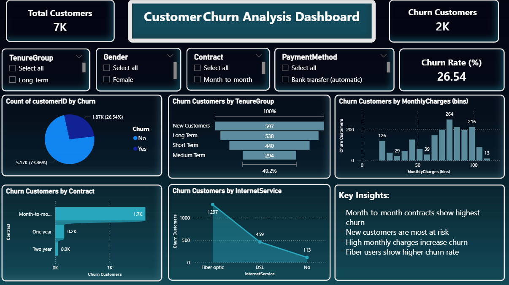

# 📊 Customer Churn Analysis Dashboard

## 🚀 Project Overview

This project focuses on analyzing customer churn behavior in a subscription-based business using data analytics techniques. The goal is to identify key factors that influence customer retention and provide actionable insights to reduce churn.

---

## 🎯 Objectives

* Analyze customer churn patterns
* Identify high-risk customer segments
* Understand factors affecting customer retention
* Provide business recommendations to reduce churn

---

## 📁 Dataset Information

* Dataset: Telco Customer Churn Dataset
* Total Records: 7043 customers
* Features: 21 columns including customer demographics, services, billing, and churn status

---

## 🛠️ Tools & Technologies Used

* Microsoft Excel (Data Understanding)
* Power BI (Data Cleaning, Modeling & Dashboard)
* Power Query (Data Transformation)
* DAX (Measures & KPIs)

---

## 🧹 Data Cleaning & Preparation

* Handled missing values in `TotalCharges`
* Corrected data types for numerical and categorical fields
* Removed blank and inconsistent entries
* Created new feature:

  * **TenureGroup** (New, Short Term, Medium Term, Long Term)

---

## 📊 Key Metrics (Cards)

* Total Customers
* Churn Customers
* Churn Rate (%)

---

## 📈 Dashboard Insights

* Customers with **month-to-month contracts** show the highest churn
* **New customers (0–3 months)** are most likely to leave early
* Customers with **higher monthly charges** have higher churn rates
* **Fiber optic users** exhibit increased churn behavior

-

## 💡 Business Recommendations

* Offer incentives for long-term contracts
* Improve onboarding experience for new customers
* Provide better support for high-value customers
* Optimize pricing strategies for high-risk segments

## 📌 Conclusion

This analysis highlights the importance of customer segmentation and proactive retention strategies. By leveraging data-driven insights, businesses can significantly reduce churn and improve customer lifetime value.

---

## 🔗 Connect with Me

Feel free to connect with me on LinkedIn and explore more of my projects!

---

⭐ If you like this project, don't forget to star the repository!
